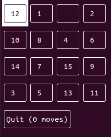

# rsey_game_jam

LGTM Has to be set up manually after template is created:

## About rsey_game_jam (aka 15 Puzzle Game)
The 15 puzzle is a sliding puzzle having 15 square tiles numbered 1–15 in a
frame that is 4 tiles high and 4 tiles wide, leaving one unoccupied tile 
position [1](https://en.wikipedia.org/wiki/15_puzzle).

## Rules
Tiles in the same row or column of the open position can be moved by
sliding them horizontally or vertically, respectively. The goal of the puzzle
is to place the tiles in numerical order 

## More Details

 * [Dependency Setup](README_dependencies.md)
 * [Building Details](README_building.md)
 * [Troubleshooting](README_troubleshooting.md)
 * [Docker](README_docker.md)
